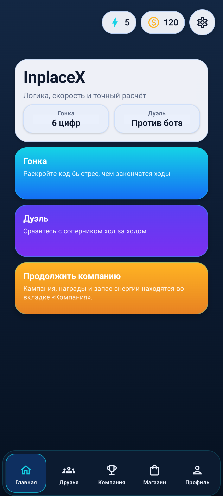
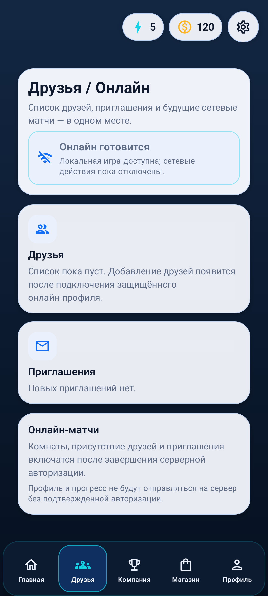
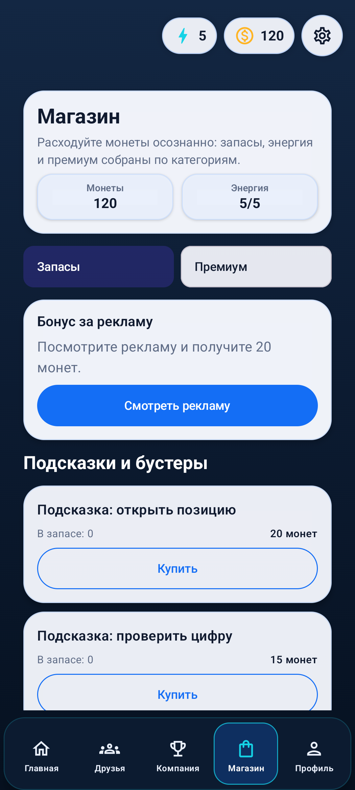
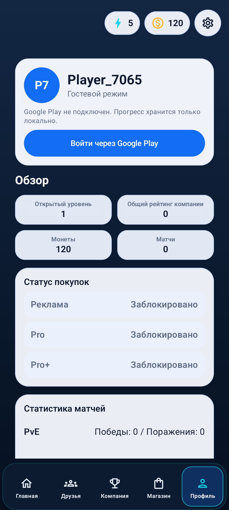
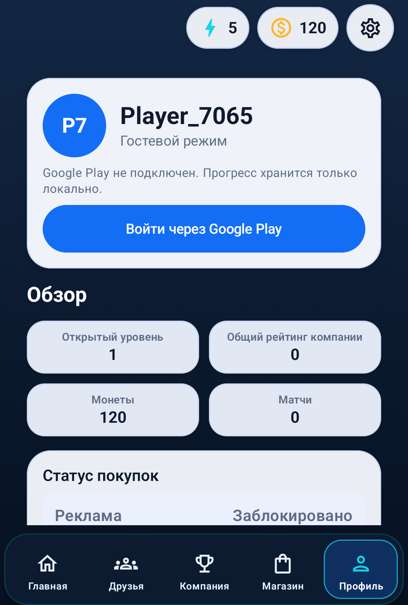

# App Shell UX v4

## Область

Срез обновляет четыре shell-экрана без изменения правил матчей:

- Главная
- Друзья
- Магазин
- Профиль

Компания остаётся отдельным вертикальным срезом `Company UX v3`.

## Historical runtime baseline

| Главная | Друзья |
|---|---|
|  |  |

| Магазин | Профиль |
|---|---|
|  |  |

Compact-height:

## Общие правила

- Главные действия имеют touch target не меньше `48dp`.
- Узкий экран не содержит двух текстовых карточек в одной строке.
- Каждый экран поддерживает прокрутку при compact-высоте и увеличенном шрифте.
- Заголовки и состояния доступны TalkBack не только через цвет.
- Неактивное действие либо скрывается, либо объясняет причину недоступности.
- Все пользовательские строки есть на русском и английском.
- Debug-провайдеры могут имитировать покупки и вход только в debug source set.
- Release-провайдеры не выдают покупку или успешный вход без реального SDK.
- Настройки содержат независимые переключатели вибрации, игровых звуков и
  музыки. Выбор сохраняется между запусками; музыка ставится на паузу вместе с
  приложением.
- В нижней части настроек находится компактный блок `Информация и поддержка`:
  связь с поддержкой, условия использования, политика конфиденциальности,
  сведения о Mirkori Games и лицензии открытого кода. Пункты открывают только
  закреплённые HTTPS-маршруты платформы в Android Custom Tab; после закрытия
  страницы пользователь возвращается в открытые настройки.

## Главная

- Race и Duel остаются двумя основными действиями.
- На compact-экране карточки режимов располагаются вертикально.
- Карточки режимов используют компактную плотность: заголовок занимает одну
  строку, пояснение — не больше двух, а все три действия остаются видимыми без
  непропорционально высокой карточки.
- Компания доступна явным действием `Компания`; пояснение не повторяет
  навигационную инструкцию.
- Переход в компанию использует глобальную shell-навигацию и не создаёт второй игровой маршрут.

## Выбор соперника

- Гонка и дуэль используют одну компактную кремовую панель выбора соперника.
- Длина секрета находится внутри отдельного смыслового блока, а основное
  действие сохраняет цвет выбранного режима: оранжевый для гонки и фиолетовый
  для дуэли.
- Недоступный online-вход остаётся явно отключённым и не маскируется под
  рабочую кнопку.

## Друзья

- Добавление друга занимает одну кнопку. Она открывает диалог поиска по имени,
  публичному `@ID` или полному техническому ID; результат показывает аватар,
  имя и публичный ID, после чего игрок явно добавляет выбранный профиль.
- Отправленная заявка отображается отдельно со статусом `Заявка в друзья
  отправлена` и не даёт начать матч. Игрок становится другом и получает кнопку
  `Играть` только после принятия заявки вторым игроком.
- Входящая заявка видна и на корне Social, и внутри `Друзей`, где её можно
  принять. Подтверждённый список друзей синхронизируется с сервером и не
  дополняется устаревшими локальными записями.
- Нижнее меню остаётся видимым на экране списка друзей. Баннерный слой может
  заменять его только внутри активного матча, а не на стартовых и социальных
  экранах.
- Экран поддерживает быстрый серверный матч и приватный код для игры с двух телефонов.
- Если в быстром подборе нет второго игрока, сервер подключает бота после установленной задержки.
- Активный онлайн-матч использует то же игровое поле, таблицу анализа и цифровую клавиатуру,
  что локальная дуэль; отдельное упрощённое поле запрещено.
- Пустые друзья и приглашения различаются.
- Debug-сборка показывает отдельного тестового друга `Mirkori Bot`; нажатие
  запускает серверный быстрый матч с VPS-ботом. В release поддельного друга нет.
- Приватное приглашение имеет короткое обучение из трёх шагов, кнопку
  копирования и системную отправку кода. Второй телефон вводит тот же
  восьмизначный код и подключается к серверной комнате.
- Перед созданием кода владелец комнаты выбирает формат:
  `На время` (оба разгадывают одновременно, побеждает первый) или
  `По очереди` (после каждого принятого хода очередь переходит сопернику),
  а также длину секрета от 4 до 10 цифр.
- Транспортные значения форматов остаются стабильными:
  `На время` передаётся как `race`, `По очереди` — как `turn_based`.
- Под выбором всегда видны правила комнаты: повторы разрешены, но максимум три
  одинаковые цифры подряд; лимита ходов нет; матч длится 10 минут.
- После подключения оба телефона показывают одинаковые настройки. В формате
  `На время` редактор доступен обоим игрокам, в формате `По очереди` — только
  игроку текущего хода.
- Верхняя панель показывает число уже сделанных ходов без дроби с лимитом и
  живой обратный отсчёт серверного времени. Истечение времени всегда выводит
  явный результат матча, а не оставляет игровое поле заблокированным.
- Недоступные сетевые действия не маскируются под рабочие кнопки.
- Настройки, ожидание, ошибки, история ходов и результаты онлайн-матча берутся
  из общего RU/EN-каталога; переключение языка не оставляет русские строки.
- Текст фиксирует границу приватности: профиль не отправляется без подтверждённой авторизации.

## Магазин

- Запасы и premium разделены переключателем категорий.
- Для каждого расходуемого предмета видны остаток и цена.
- При нехватке монет действие отключено и имеет текстовую причину.
- Успех или отказ рекламы, локальной покупки и billing-покупки отображается внутри экрана.
- Активные premium-продукты нельзя купить повторно.

## Профиль

- В первом блоке видны имя, тип сессии и результат входа/выхода.
- Игрок может назначить или изменить уникальный публичный `@ID`; технический
  `gamePlayerId` остаётся доступен для копирования и не меняется.
- Отказ авторизации не выглядит как «ничего не произошло».
- Обзор прогресса адаптируется с четырёх колонок до сетки 2×2.
- Покупки и статистика матчей отображаются отдельными смысловыми группами.

## Проверка

Для каждого экрана обязательны:

1. RU и EN.
2. compact portrait и tall portrait.
3. compact-height в портретном окне.
4. font scale не меньше `1.3`.
5. TalkBack-заголовки, состояния и минимум `48dp` для действий.
6. `testDebugUnitTest`, `assembleDebug` и smoke на физическом устройстве.
