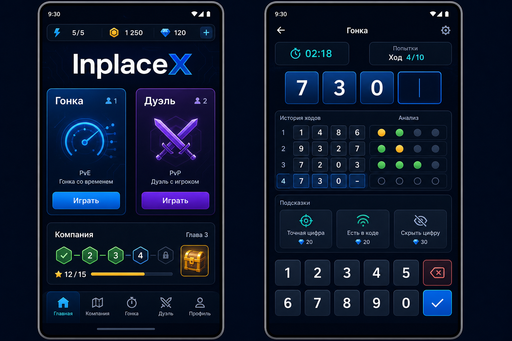
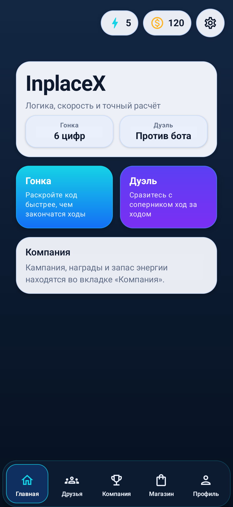
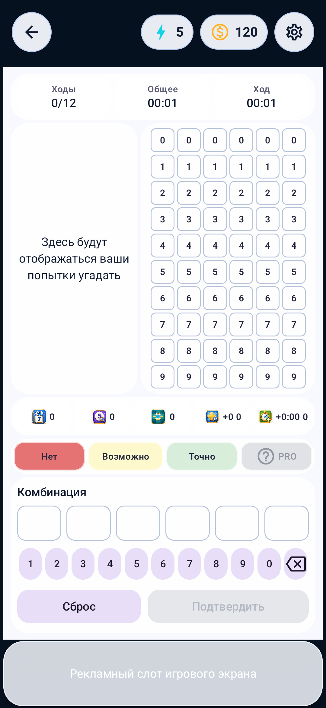

# Design System v2

## Цель

Новый визуальный язык должен сделать InplaceX узнаваемой логической игрой, сохранив быстрый вход в матч и существующую структуру продукта.

Ключевая метафора: интеллектуальная игровая консоль. Интерфейс должен ощущаться точным, энергичным и спокойным, без стилистики казино и без перегруженного неона.

Концепт задаёт направление, а не пиксель-в-пиксель контракт. Каноническая реализация остаётся в Compose и обязана учитывать реальные данные, локализацию, доступность и размеры экранов.

## Проверенный первый срез

Первый runtime-срез включает брендовые токены, фон, top resources, нижнюю навигацию, Home и общие scene-компоненты.

| Home, API 35 | Текущее поле Race, API 35 |
|---|---|
|  |  |

Поле `Race` на втором снимке сохраняет текущую структуру и поведение. Его внутренняя визуальная миграция относится к следующему отдельному этапу.

## Принципы

- Главный выбор режима виден без прокрутки.
- `Duel` и `Race` остаются двумя базовыми игровыми полями.
- Цвет усиливает смысл, но состояние никогда не кодируется только цветом.
- Главные действия имеют touch target не меньше `48dp`.
- Текст и критические игровые значения должны проходить контраст не ниже WCAG AA.
- Декоративные эффекты не уменьшают читаемость и отключаются при необходимости.
- Debug, secret и тестовые элементы не появляются в release-потоках.

## Палитра

| Роль | Цвет |
|---|---|
| Основной фон | `Midnight #061120` |
| Поднятая тёмная поверхность | `MidnightElevated #0C1B31` |
| Бренд / основное действие | `Cobalt #146EF5` |
| Второй режим / дуэль | `Indigo #5B3FF2` |
| Информация / активный фокус | `Cyan #15D3E6` |
| Награда / монеты | `Amber #FFB423` |
| Успех | `Mint #36C98F` |
| Ошибка / опасное действие | `Coral #FF6B6B` |

Runtime-источник токенов: `ui/theme/Color.kt`.

## Поверхности

- Внешний shell использует тёмный брендовый фон.
- Контентные карточки первого этапа остаются светлыми и непрозрачными для стабильной читаемости.
- Полупрозрачность допустима только вместе с непрозрачным fallback.
- Системный dynamic color не должен менять брендовые цвета production-сборки.

## Типографика

- Крупный брендовый заголовок — короткий, жирный, без декоративного шрифта.
- Игровые значения, таймер и число ходов визуально важнее поясняющего текста.
- Текст кнопки описывает действие: `Играть`, `Подтвердить`, `Продолжить`.
- В пользовательском UI не используются архитектурные термины вроде `shared match engine`.

## Этапы внедрения

1. Токены, тема, общий shell и общие scene-компоненты.
2. Главная, навигация и карточки режимов.
3. Поле `Race`.
4. Setup и поле `Duel`.
5. Компания, онлайн, магазин, профиль и настройки.
6. Анимации, haptics, accessibility и визуальная регрессия.

На каждом этапе поведение экрана фиксируется до визуальной замены и проверяется после неё.
